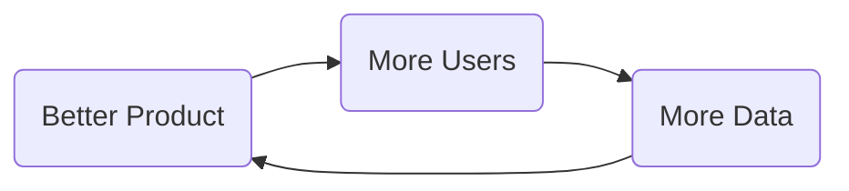
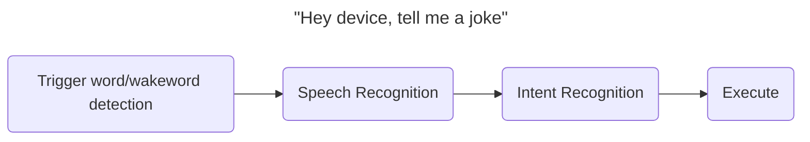
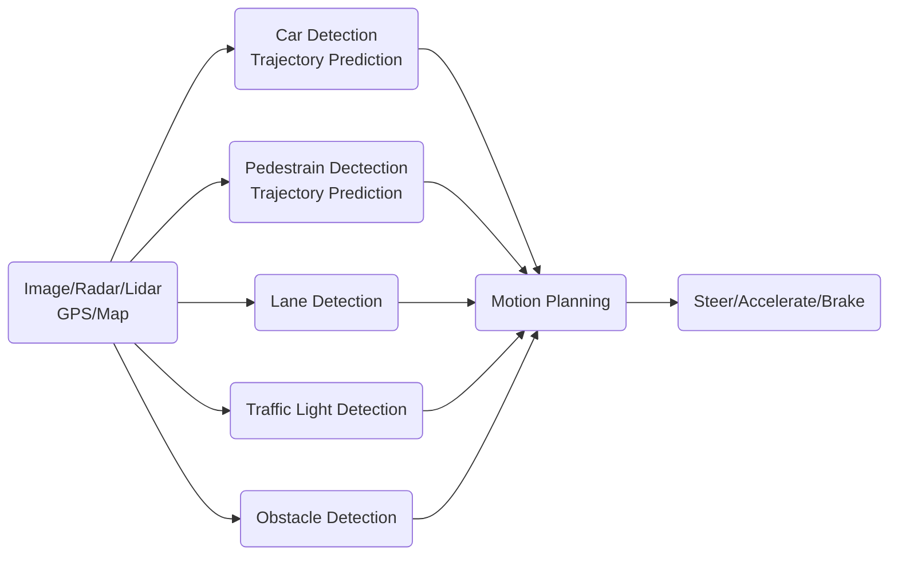

### Resources
[AI For Everyone](https://www.coursera.org/learn/ai-for-everyone/home/module/1)

 

ANI|AGI
---|---
Artificial narrow intelligence|Artificial general intelligence
E.g., smart speaker, self-driving car, web search, Al in farming and factories|Do anything a human can do

(NLP)  Natural language processing

 

### AI vs Machine Learning vs Deep Learning
[[Machine Learning]]

![[AI vs Machine Learning vs Deep Learning.jpg | 500]]

### An AI Company?

Any company + deep learning ‡ AI company

- Strategic data acquisition
- Unified data warehouse
- Pervasive automation
- New roles (e.g., MLE) and division of labor

AI Transformation in a company
![[LandingAI_Transformation_Playbook_11-19.pdf]]

Cross Functional Team
What AI can do ↔ Valuable for your business
     AI Expert     ↔             Domain Expert

CIO Chief Information Officer
CAIO Chief AI Officer

##### Provide broad AI training in the company

Role|What they should learn、
---|---
Executives and senior business leaders|What Al can do for your enterprise Al strategy Resource allocation
Leaders of divisions working on Al projects|Set project direction (technical and business diligence) Resource allocation Monitor progress
Al engineer trainees|Build and ship Al software Gather data Execute on specific Al projects

##### "Virtuous Cycle of AI"

 

### Brainstorming Framework
 
- Automating the task rather than Automation the job
- What are the main drivers of business value?
- What are the main pain points in your business?

> [!NOTE]- You can make progress even without big data
> Contents

Technical diligence|Business diligence
---|---
Can Al system meet desired performance How much data is needed Engineering timeline|Lower costs Increase revenue Launch new product or business

 

### Case Studies

##### Smart Speaker

##### Self Driving Car

### Roles ( Still Evolving **)

- Software Engineer
---
- Machine Learning Engineer
↓
- Machine Learning Scientist
↑
- Machine Learning Researcher
---
- Data Scientist
	-   Examine data and provide insights
	-   Make presentation to team/executive

- Data Engineer
	-   e.g. Self-driving car generate TB / PB level data need to be organized → Organize data
	-   Make sure data is saved in an easily accessible, secure and cost effective way
---
AI Product Manager

Strategy
Data acquisition: launch free services to collect data
Unified data warehouse