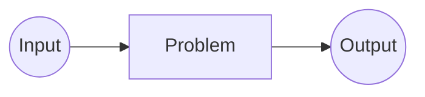
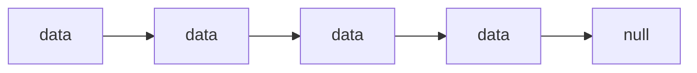

Algorithms and Data Structure

A Data Structure (DS) is a way of organizing data so that it can be used effectively.

### Tutorial

<iframe width="560" height="315" src="https://www.youtube.com/embed/8hly31xKli0" title="YouTube video player" frameborder="0" allow="accelerometer; autoplay; clipboard-write; encrypted-media; gyroscope; picture-in-picture; web-share" allowfullscreen></iframe>

### Algorithm Thinking

>[!tip]
>1.  Clearly defined problem statement, input, and output.
2.  The steps in the algorithm need to be in a very specific order.
3.  The steps also need to be distinct.
4.  The algorithm should produce a result.
5.  The algorithm should complete in a finite amount of time.

##### **Complexity Analysis**

Time & Space

**Big-O Notation**

BIg-O Notation gives an upper bound of the complexity in the worst case, helping to quantify performance as the input size becomes arbitrarily large.

<i>_n - The size of the input</i> 
Complexities ordered from smallest to largest

>[!example]
Constant Time: 0(1)
Logarithimic Time: 0(log(n))
Linear Time: 0(n)
Linearithmic Time: 0(nlog(n))
Quadric Time: 0(n²)
Cubic Time: 0(n³)
Exponential Time: 0(bⁿ), b > 1
Factorial Time: 0(n!)

 

![[big-o-properties.png ]]
![[big-o-calculation.png]]

 

**Static Array**

A static array is a fixed length container containing n elements indexable from the range [0, n-1]

'indexable' -> each slot/index in the array can be referenced with a number

 

##### **When and where is a static Array used?**

1.  Storing and accessing sequential data
2.  Temporarily store objects
3.  Used by IO routines as buffers
4.  Lookup tables and inverse lookup tables
5.  Can be used to return multiple values from a function
6.  Used in dynamic programming to cache answers to subproblems

**Complexity** - Static Array Dynamic Array

 | 
--|--|--
Access|0(1)|0(1)
Search|0(n)|0(n)
Insertion|N/A|0(n)
Appending|N/A|0(1)
Deletion|N/A|0(n)

 

**Dynamic Arrays**

The dynamic array can grow and shrink in size

Q: How can we implement a dynamic array?

A: One way is to use a static array!

1.  Create a static array with an initial capacity.
2.  Add elements to the underlying static array, keeping track of the number of elements.
3.  If adding another element will exceed the capacity, then create a new static array with twice the capacity and copy the original elements into it.

![[dynamic-array.png]]

 

### Singly and Doubly Linked Lists

**What is a linked list?**

A linked list is a sequential list of nodes that hold data which point to other nodes also containing data.

-   Used in many List, Queue & Stack implementations
-   Great for creating circular lists
-   Can easily model real world objects such as trains
-   Used in separate chaining, which is present certain Hashtable implementations to deal with hashing collisions
-   Often used in the implementation of adjacency lists for graphs

 

**Terminology**

**Head**: The first node in a linked list

**Tail**: The last node in a linked list

**Pointer**: reference to another node

**Node**: An object containing data and pointer(s)

![[head-pointer-node-tail.png]]
 
&nbsp |**Pros**|**Cons**
--|--|--
**Singly Linked**|Uses less memory Simpler implementation|Cannot easily access previous elements
**Doubly Linked**|Can be traversed backwards|Takes 2x memory

 

### Queue

A queue is a linear data structure which models real world queues by having two primary operations, namely ==enqueue== and ==dequeue==.

![[queue.png]]

Enqueue - Adding - offering
Dequeue - polling

In GitHub Wiki markdown I used hash marks (#) followed by two spaces to make the line break larger. It doesn't actually give you multiple line breaks but it made one large line break and served me well for my needs.

Instead of:

**When and where is a Queue used?**

Any waiting line models a queue, for example a lineup at movie theatre.
Can be used to efficiently keep track of the most recently added elements.

Web server request

 

### Stack (栈)

First In Last Out (FILO) 

**When and where is a Stack used?**

-   Used by undo mechanisms in text editors.
-   Used in compiler syntax checking for matching brackets and braces
-   Can be used to model a pile of books or plates
-   Used behind the scenes to support recursion by keeping track of previous function calls
-   Can be used to do Depth First Search (DFS) on a graph

 

### Binary Search Tree

A <mark style="background-color: #3A4F7F"> tree</mark> is an <mark style="background-color: #3A4F7F">undirected graph</mark> which satisfies any of the following definitions:

-   An ==acyclic== connected graph ==acyclic → no cycle==
-   A connected graph with N nodes and ==N-1 edges==
-   An graph in which any two vertices are connected by exactly ==one path==

![[rootnode-leafnode.jpg | 300]]

-   A child is a node extending from another node
-   A parent is the inverse of this
-   A Leaf node is a node with no children

Root node has no parent, although it may be useful to assign the parent of the root node to be itself

File System is tree!

![[subtree.jpg | 300]]

-   A subtree is a tree entirely contained within another. They are usually denoted using triangles.

>[!note] 
>Subtrees may consist of a single node

**Binary Tree (BT) :** **A tree for which every node has at most two child nodes**

![[not-binary-tree.jpg]]

**Binary Search Tree (**BST**) : **A Binary Search Tree**is a binary tree that satisfies the **BST invariant**: left subtree has smaller elements and right subtree has larger elements**

//Binary Search Tree Graph here:

**When and where are Binary Trees used?**

-   Binary Search Trees (BSTs)
    -   Implementation of some map and set ADTs
    -   Red Black Trees
    -   AVL Trees
    -   Splay Trees

...

-   Used in the implementation of binary heaps
-   Syntax trees (used by compiler and calculators)
-   Treap - a probabilistic DS (uses a randomized BST)

 

### Hash Tables

A Hash Table (HT) is a data structure that provides a mapping from keys to values using a technique called hashing. The key-value pairs in a HT can be of any type not just strings and numbers, but also objects. The keys needs to be hashable.

Key (Name)|Value (fav color)
---|---
"William"|"green"
"Micha"|"purple"
"Catherine"|"yellow"
"Thomas"|"red"
"Leah"|"purple"

We refer to these as key-value pairs pairs. Keys must be unique, but values can be repeated

A hash function H(x) is a function that maps a key 'x' to a whole number in a fixed range.

Try to make uniform hash functions to minimize the number of hash collisions. A hash collision is when two objects x, y has to the same value (i.e. H(x) = H(y)). If H(x) = H(y) then objects x and y might be equal, but if H(x) ≠ H(y) then x and y are certainly not equal. Instead of comparing x and y directly, compare hash value first, then explicitly compare x and y.

A hash function H(x) must be deterministic. (The hash function must produce the same result all time, no randomness)

**What makes a key of type T** **hashable****?**

Keys used in our hash table are immutable data types. 

 

### Union Find (并查集)

Union Find is a data structure that keeps track of elements which are split into one or more disjoint sets. It has two primary operations: find and union.

When and where is a Union Find Used?

-   Kruskal's minium spanning tree algorithm
-   Grid percolation
-   Network connectivity
-   Least common ancestor in trees
-   Image Processing

Amortized constant time

Kruskal's Minimum Spanning Tree

![[spanning-tree-1.png]]|![[spanning-tree-2.png]]
---|---