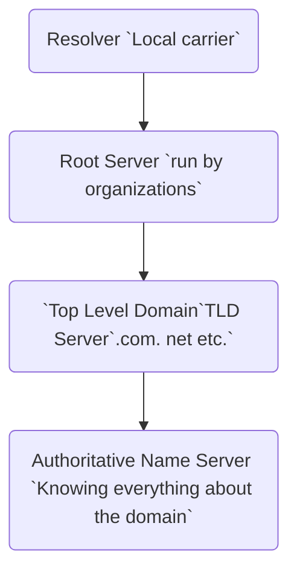

#IT #web-dev 

### Load Balancer 负载均衡

NGINX

层级越高 性能 ↓ 功能 ↑

DNS 负载均衡 （反向代理服务器）

 

### Networking Reference Models

![[Networking Reference Models.png]]

##### The Open System Interconnection (OSI) model

Layer 7 - Application | HTTP

Layer 6 - Presentation | convert from machine dependent language to machine independent langue, encryption

Layer 5 - Session | Setup/tear down communication channels

Layer 4 - Transport | TCP UDP

Layer 3 - Network | Multilayer switch, Router

Layer 2 - Data Link | Switch, Wireless access point (WAP) Only communicate with local network devices

Layer 1 - Physical | Analog Modem, Hub

##### TCP/IP reference model

Layer 4 - Application |
Layer 3 - Transport |
Layer 2 - Internet |
Layer 1 - Network Interface layer a.k.a. Link layer

##### Comparison
- OSI is more specific, more common to discussing the problem
- TCP/IP is more dominant
Both are references, not mandatory

 

### [TCP](https://www.youtube.com/watch?v=uwoD5YsGACg) (Transmission Control Protocol)

==Connection== oriented protocol, TCP makes sure all ==data received in order==.

TCP guarantees the data will be received, will resend if not received.

##### UDP (User Datagram Protocol)

==Connectionless== oriented Protocol, UDP does not ==establish sessions and guarantees the data will be received==. ==Faster== speed than TCP.

  

### [Port Number](https://www.youtube.com/watch?v=RDotMcs0Erg)

A IP Address could do many services such as HTML, SMTP, FTP etc. Port Number will specify port on an IP address.

![[port-number-1.png]]|![[port-number-2.png]]
---|---

-   0 - 1023 -> Well known port #
-   1024 - 49151 (Company) Registered port #
-   49152 - 65535 Dynamically assigned port #

Manually change port:
![[manual-change-port.png]]

 

### [IP Address](https://youtu.be/ThdO9beHhpA) (Internet Protocol address)

A numerical address. It’s an identifier for a computer or device on a network

Every device has to have an IP address for communication purposes

IP version 4 (IPV4)

-   IPV4 is the current version, 32 bit numeric address separated by periods
    
-   Computer read binary IP address -> `66``.94.29.13` -> `01000010.01011110,00011101.00001101`
    
-   There are ==4,294,967,296 public IPv4 addresses== available.

> [!tips] [NAT](https://www.youtube.com/watch?v=FTUV0t6JaDA) (Network Address Translation)
>
>NAT is used in routers, translating a set of IP addresses to another set of IP addresses, that helps preserve the limited amount of IPv4 public IP addresses.
>
>NAT translates:
>
>Private to Public / Public to Private
>
>==In the future, wont use NAT or private IP addresses, will use IPv6==

![[types-of-IPv4.png]]

IP version 6 (Next Gen IP) (IPV6)

-   128 bit hexadecimal address
    
-   Hexadecimal uses both numbers and alphabet
    
-   Capable of producing over ==340 undecillion addresses==
  
> [!error]
>Two devices that use the same IP address will cause IP conflict, these two devices will not get access to the network.

An IP address consists of two parts: Network address, Host address

![[network-address-host-address.png | 500]]

##### [Subnet Mask](https://www.youtube.com/watch?v=s_Ntt6eTn94) 子网掩码 -> `255.255.255.0`

A subnet mask reveals how many bits in the IP address are used for the network by masking the network portion of the IP address. Subnetting is done by changing the default subnet mask by borrowing some of the bits from the host portion

![[subnetmask-1.png]]|![[subnetmask-2.png]]
--|--

Portion

![[subnetmask-portion-1.png]]|![[subnetmask-portion-2.png]]
--|--

![[subnetmask-portion-3.png]]|![[subnetmask-portion-4.png]]
--|--

Class | First Octet Address|Default Subnet Mask
---- | ---- | ----
A | 1-127 | 255.0.0.0
B | 128-191 | 255.255.0.0
C | 192-223 | 255.255.255.0

CIDR - Classless Inter-Domain Routing (Slash notation)
![[CIDR.png]]

   

##### [Default Gateway](https://www.youtube.com/watch?v=pCcJFdYNamc)

A default gateway forwards data from one network to another (mostly a router)

Default means that the designated device is the first option that's looked upon when data needs to exit the network.

By IP address and subnet mask, devices know which devices are on the same network and which are not.

![[default-gateway.png]]

 

##### [DHCP](https://www.youtube.com/watch?v=e6-TaH5bkjo) (Dynamic Host Configuration Protocol)

DHCP is a service that runs on a server, such as Mircosoft, Linux server. It's also runs on routers.

Static IP: A static IP is where a user assigns an IP address manually confided, and also includes: Subnet mask, Default gateway, DNS server ...

![[static-IP.png | 300]]

Dynamic IP: A dynamic IP is where a computer gets an IP address from a DHCP server.

![[dynamic-IP.png]]|![[DHCP-enable.png]]
---|---

A DHCP server automatically assigns a computer an:

-   IP address
-   Subnet mask
-   Default gateway
-   DNS server

 

DHCP scope

The range of IP address that the DHCP can assign to
![[DHCP-scope.png]]

The DHCP server assigns the IP address as **lease**.

-   A lease is the amount of time an IP address is assigned to a computer.
    
-   The lease is to help make sure the DHCP server does not run out of IP addresses.
    

  

DHCP **reservation** ensures that a specific computer or device will always be given the same IP address.

  

### [MAC Address](https://www.youtube.com/watch?v=TIiQiw7fpsU) (Media Access Control address)

Made up of a 6 byte hexadecimal number that is burned into every NIC (Network Interface Card). The MAC address is also referred to as the physical or hardware address

  

00-04-5A-63-A1-66 
00-04-5A-63-A1-66

The first 3 bytes identify the manufacturer of the NIC|The last 3 bytes are a unique number from the manufacturer that identifies each device on a network
---|---

> [!NOTE] Title
> **Windows: 00-04-5A-63-A1-66**
**Apple&Linux**: 00:04:**5A**:63:A1:66
**Cisco: 0004.5A63.A166**

vs IP Address
IP address can periodically changed
MAC address is permanent

-   IP address -> locate a device
-   MAC address -> identify a device

![[MAC address.png]]

> [!info] Windows: ipconfig /all
>Linux / Mac: ifconfig
>One computer can have many MAC addresses, depending on the number of network interface

##### **ARP** (Address Resolution Protocol) broadcast

IP Address to MAC address
APR cache: storing MAC address cache
ARP entries: Dynamic / Static
-   Dynamic entry is created automatically when a device sends out a broadcast message out on the network.
-   Dynamic entries are not permanent. They are flushed out periodically.
-   A static entry is where someone manually enters an IP to MAC address association using the ARP command line utility.

  

### DNS (Domain Name System)

Resolve domain names to IP addresses

 

### [Telnet](https://www.youtube.com/watch?v=tZop-zjYkrU) (Teletype Network) Developed in 1969

Command line

Clear text, no encryption

### SSH (Secure Shell)

Encrypts the data, provide password and public key authentication

 

### HTTP, HTTPS, SSL, TLS

##### HTTP (HyperText Transfer Protocol)

All information is sent in clear text, not secure, vulnerable

##### HTTPS (Secure HyperText Transfer Protocol)

HTTP with a security feature, data is encrypted

##### SSL, Secure Sockets Layer, use public key encryption to secure data

##### TLS, Transport Layer Security, lastest industry standard cryptographic protocol

The successor to SSL

 

### FTP, SFTP, TFTP - Protocols that are used to transfer files over a network

FTP, SFTP use connection oriented protocols, use TCP

##### FTP (File Transfer Protocol)

The standard protocol that is used to transfer files between computers and servers over a network. FTP is the language that computers use to transfer files over a TCP/IP network.

Use Browser or "FTP Client" ftp.example.com

FTP is not a secure protocol, data being transferred is not encrypted.

##### SFTP (Secure File Transfer Protocol)

Add a layer of security, data is encrypted using secure shell. Use port 22

##### TFTP (Trivial File Transfer Protocol)

Simple transfer protocol, mainly used for transferring files within local network. No security. Uses connectionless oriented protocols, use UDP.

 

### [POP3 and IMAP](https://www.youtube.com/watch?v=SBaARws0hy4) (Used for retriving emails)

Used for retrieving email from an email server.

**POP3 (Post Office Protocol 3)**

[Simple] Only downloading the email to your device from a mail server, not synchronized.

Only download inbox folder, the email is deleted on the mail server once it is downloaded to a device. In setting, the option to leave a copy.

Good for if the user only uses email from one device

-   Pros: Downloaded mail is viewable without internet connection, save storage on mail server,
    
-   Cons: Need a backup of email due to potential email lost. The device is more vulnerable to viruses since emails are fully downloaded.

**IMAP** **(Internet Message Access Protocol)**

IMAP allows you to view your email on the server from multiple devices. IMAP caches local copies of the email onto all of your devices, synchronized all folders.

Good for if the user uses multiple devices.

-   Pros: All the email is stored on the mail server. The user will be able to browse all emails in all folders. All emails and folders are synchronized.
    
-   Cons: Email is caches, not fully downloaded, without internet, email is not viewable.
    

  

### [SMTP](https://www.youtube.com/watch?v=PJo5yOtu7o8) (Simple Mail Transfer Protocol) (Used for sending email)

A set of commands that authenticates and directs the transfer of email.

-   Sending Mail To People
    

Use TCP protocol, guaranteed delivery.
![[SMTP.png | 500]]

  

### LAN, WAN, PAN, CAN, MAN, SAN, WLAN

##### PAN (Personal Area Network)

Personal Level - Connected by Bluetooth, Infrared, NFC, USB-cable. For small files.

##### LAN (Local Area Network)

A group of devices (computers, servers, switches, & printers) that are located in the same building. Connected by Ethernet LAN, switch.

##### WLAN (Wireless Local Area Network)

LAN without cable. Connected by wireless router, hot-spot, Wi-Fi.

##### VLAN (Virtual Local Area Network)

In a VLAN, the computers, servers, and other network devices are logically connected regardless of their physical location.

-   Improve security
    
-   Traffic management
    
-   Make a network simpler
    

##### CAN (Campus Area Network)

2 or more LANs within a limited area.
![[CAN.png | 500]]

##### MAN (Metropolitan Area Network)

Larger than CAN. Connect several buildings in a city or town. Connected by High-Speed fiber cable

##### SAN (Storage Area Network)
A special high-speed network that stores and provides access to large amounts of data. Independent network, not affected by other network traffic.

![[SAN.png | 500]]

##### WAN (Wide Area Network)

Largest type of network spans over a large geographical area. The internet is an example of WAN.

  

### Utility

##### PING

network connectivity, name

Echo reply request

`PING (IP address or domain name)`

![[Echo-request-google.png | 500]]

![[Echo-request-baidu.png | 500]]

Switches - sub commands used to alter utility parameters

##### Traceroute
![[Traceroute.png]]

##### Netstat (Network Statisitics)

Command line tool that is used to display the current network connections and port activity on your computer.

|`netstat`|`netstat -n`|
|-|-|
|resolve name, slow|not resolve name, fast|
|![[netstat.png]]|![[netstat-n.png]]|

### [DMZ](https://www.youtube.com/watch?v=dqlzQXo1wqo) (Demilitarized Zone)

Used to improve the security of an organization's network by segregating devices, such as computers and 

|![[DMZ-1.png]]|![[DMZ-2.png]]|![[DMZ-3.png]]|
|-|-|-|

A DMZ divides a network into 2 parts, by taking devices from inside the firewall and then putting them outside the firewall.

A DMZ is where firewall protection is forbidden.

  

### [DDos](https://www.youtube.com/watch?v=ilhGh9CEIwM) (Distributed Denial of Service)

A cyber attack on a specific server or network, an intended purpose of disrupting normal operation by flooding the target with a constant flood of traffic.

![[DDos.png | 300]]