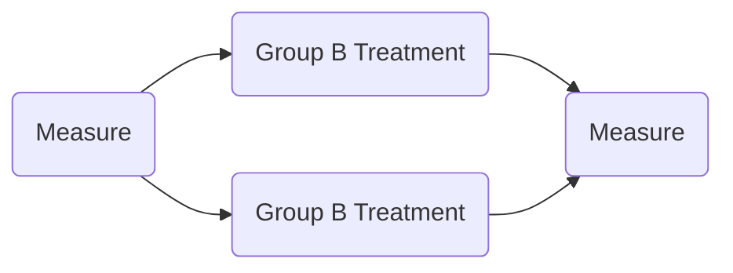
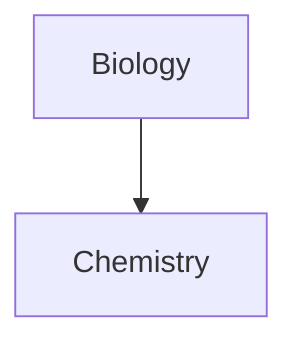

#markdown 


https://youtu.be/FEa2diI2qgA

[Format your notes by Obsidian Help](https://help.obsidian.md/How+to/Format+your+notes#:~:text=appear%20crossed%20out.-,Highlighting,to%20%3D%3Dhighlight%20text%3D%3D)

[# Basic Syntax](https://www.markdownguide.org/basic-syntax/#code)

### Text
  
Markdown ↔ HTML
```
# ↔ <h1>
```

Alternative Heading with line

```Markdown
Heading level 1
===============
```

```Markdown
Heading level 2
---------------
```

##### New Line
`&NewLine`
`<br>`
`\`
`\`

###### `Use `code` in your Markdown file.`
```html
<code>Use `code` in your Markdown file.</code>
```

###### Text alignment
<div align="center" >
Pos (Anchor to Pivot Point) <br>
Width, Height -> Fixed Size
</div>

``` html 
<div align="center" >
Pos (Anchor to Pivot Point) <br>
Width, Height -> Fixed Size
</div>
```

Color from [Arco Design Palette](https://arco.bytedance.net/palette/list)

<span style="color: #86909c">&#9632中性灰 86909c</span>

<div style="display: grid; grid-template-columns: repeat(3, 2fr); grid-gap: 10px;">
	<div>
		<span style="color: #F53F3F">&#9632  浪漫红 F53F3F</span><br>
		<span style="color: #F77234">&#9632晚秋红 F77234</span><br>
		<span style="color: #FF7D00">&#9632活力橙 FF7D00</span><br>
		<span style="color: #F7BA1E">&#9632黄昏 F7BA1E</span><br>
		<span style="color: #FADC19">&#9632柠檬黄 FADC19</span><br>
	</div>
	<div>
			<span style="color: #9FDB1D">&#9632新生绿 9FDB1D</span><br>
			<span style="color: #00B42A">&#9632仙野绿 00B42A</span><br>
			<span style="color: #14C9C9">&#9632碧涛青 14C9C9</span><br>
			<span style="color: #3491FA">&#9632海蔚蓝 3491FA</span><br>
	</div>
	<div>
			<span style="color: #165DFF">&#9632极致蓝 165DFF</span><br>
			<span style="color: #722ED1">&#9632暗夜紫 722ED1</span><br>
			<span style="color: #D91AD9">&#9632青春紫 D91AD9</span><br>
			<span style="color: #F5319D">&#9632品红 F5319D</span><br>
	</div>
</div>

```html
<span style="color: #86909c">&#9632中性灰 86909c</span>

<div style="display: grid; grid-template-columns: repeat(3, 2fr); grid-gap: 10px;">
	<div>
		<span style="color: #F53F3F">&#9632  浪漫红 F53F3F</span><br>
		<span style="color: #F77234">&#9632晚秋红 F77234</span><br>
		<span style="color: #FF7D00">&#9632活力橙 FF7D00</span><br>
		<span style="color: #F7BA1E">&#9632黄昏 F7BA1E</span><br>
		<span style="color: #FADC19">&#9632柠檬黄 FADC19</span><br>
	</div>
	<div>
			<span style="color: #9FDB1D">&#9632新生绿 9FDB1D</span><br>
			<span style="color: #00B42A">&#9632仙野绿 00B42A</span><br>
			<span style="color: #14C9C9">&#9632碧涛青 14C9C9</span><br>
			<span style="color: #3491FA">&#9632海蔚蓝 3491FA</span><br>
	</div>
	<div>
			<span style="color: #165DFF">&#9632极致蓝 165DFF</span><br>
			<span style="color: #722ED1">&#9632暗夜紫 722ED1</span><br>
			<span style="color: #D91AD9">&#9632青春紫 D91AD9</span><br>
			<span style="color: #F5319D">&#9632品红 F5319D</span><br>
	</div>
</div>
```

<br>

==Highlight==
```markdown
==Hightlight==
```

<mark>Highlighted text</mark>
<mark style="background-color: #3A4F7F">Highlighted text</mark>  

``` html
<mark>Marked text</mark>

<mark style="background-color: #3A4F7F">Highlighted text</mark>  
```

---
```
---
```

<hr>

```
<hr>
```


### Use HTML

```HTML
<p align="center">text</p>
```

### Image

##### Markdown Image

```


```

==folder name can not contain space==

##### HTML Image Alignment

```Markdown
居中
<p align="center" width="100%">
    
</p>

居右
<p align="right" width="100%">
    
</p>
```

##### HTML Column Layout (Only for `` image)

<div style="display: grid; grid-template-columns: repeat(3, 2fr); grid-gap: 10px;">
	

 
 </div>

``` HTML
div style="display: grid; grid-template-columns: repeat(3, 2fr); grid-gap: 10px;">
	

 
 </div>
```

[Grid-Layout-Tutorial](https://www.freecodecamp.org/news/how-to-create-an-image-gallery-with-css-grid-e0f0fd666a5c/)

##### List Grid
<div style="display: grid; grid-template-columns: repeat(3, 2fr); grid-gap: 10px;">
	<div>
		 <li>Uniform Color</li>
		 <li>HSL (adjust color)</li>
		 <li>Level</li>
	</div>
	<div>
		<li>Shape (Grey Scale)</li>
		<li>Polygon (Grey Scale)</li>
		<hr>
		<li>Linear Gradient</li>
	</div>
	<div>
		<li>Tile Generator</li>
	</div>
</div>

``` HTML
<div style="display: grid; grid-template-columns: repeat(3, 2fr); grid-gap: 10px;">
	<div>
		 <li>Uniform Color</li>
		 <li>HSL (adjust color)</li>
		 <li>Level</li>
	</div>
	<div>
		<li>Shape (Grey Scale)</li>
		<li>Polygon (Grey Scale)</li>
		<hr />
		<li>Linear Gradient</li>
	</div>
	<div>
		<li>Tile Generator</li>
	</div>
</div>
```


### Link
```
[name](address)
```

##### Obsidian Specific 

Link to specific header
[[Data Science VS Machine Learning#Machine Learning Process]]
``` markdown
[[Data Science VS Machine Learning#Machine Learning Process]]
```

![[Data Science VS Machine Learning#Machine Learning Process]]

Link to specific block
[[Data Science VS Machine Learning#^122696]]
``` markdown
[[Data Science VS Machine Learning#^122696]]
```

Embedding
![[Data Science VS Machine Learning#^122696]]

### Table
##### markdown

`&nbsp` for empty cell

##### HTML
```HTML
<table>
    <tr>
        <td>遮挡物模型</td>
        <td>应用效果</td>
    </tr>
    <tr>
        <td></td>
        <td></td>
    </tr>
</table>
```

##### Customize Cell Length

**英文**|**中文**
---|---
Polynomial|多项式

```
**英文**|**中文**
---|---
Polynomial|多项式
```

### [Callout](https://help.obsidian.md/Editing+and+formatting/Callouts) for obsidian
```
> [!info] > Here's a callout block. 
> It supports **Markdown**, [[Internal link|Wikilinks]], and [[Embed files|embeds]]! 
> ![[og-image.png]]
```

Types:
- note
- abstract / summary / tldr
- info
- todo
- tip, hint, important
- success, check, done
- question, help, faq
- warning, caution, attention
- failure, fail, missing
- danger / error
- bug
- example
- quote/ cite

### Graph

[Mermaid](https://mermaid.js.org/syntax/flowchart.html)





<br>

### Equation Latex

https://katex.org/docs/supported.html

[Math Symbol](https://oeis.org/wiki/List_of_LaTeX_mathematical_symbols)


```latex
inline equation
$ ... $

equation block
$$ ... $$
```

<br>

$$\begin{bmatrix}a&b\\c&d\end{bmatrix}$$

$$ A^T \times B^T = (B \times A)^T $$

<br>

Name|Sign|Latex
---|---|---
intersection|$\cap$  $\bigcap$|`\cap`  `\bigcap`
union|$\cup$|`\cup`


