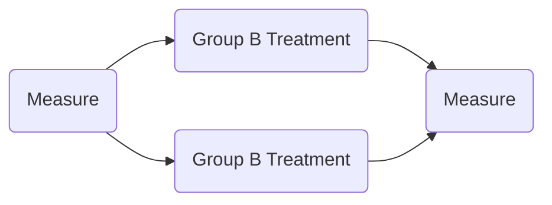
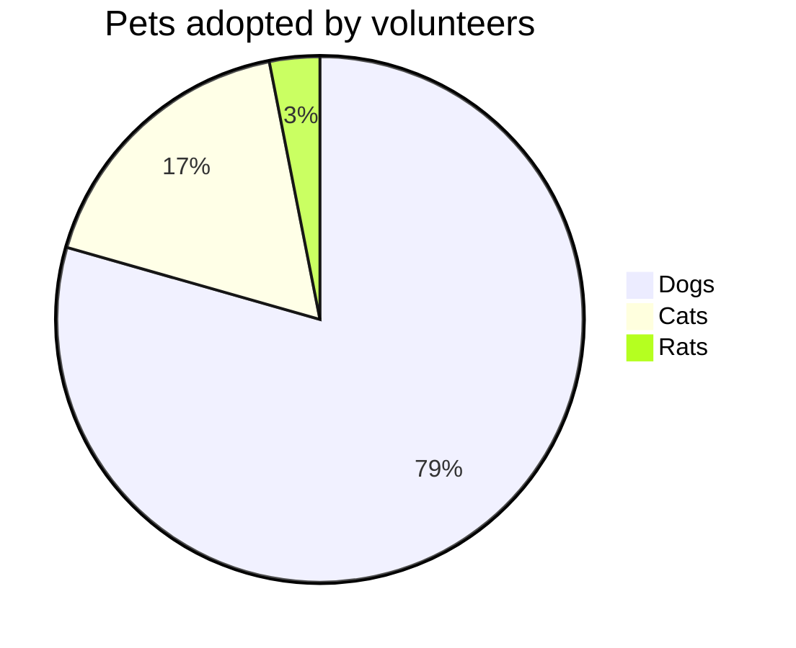

#data 

[YouTube](https://youtu.be/xxpc-HPKN28)

[[Statistics Math]]
[[Probability]]

Statistic is the study of how to collect, organize, analyze, and interpret numerical information and data.
Statistic is both the science of uncertainty and the technology of extracting information from data.
Statistics is used to help us make decision. This is especially important in health care and public health

- Individual are people or objects included in a study
- A variable is a characteristic of the individual to be measured or observed

Statistic Help decision making

---
### Statistical Question

to collect data with variability

Examples:
- What is the average number of cars in a parking lot on Monday mornings?
- How much time do the members of my family spending eating per year?

---
##### 3 Types of data

1.  Numerical → Quantitive (数量的)
    1.  Discrete →
    2.  Continuous → Speed
        
2.  Categorical → Qualitative (定性的，语言的) → Gender, Nationality
3.  Ordinal → Mixing numerical and categorical → Hotel Ratings (3 star hotels may vary)

  

##### 3 Types of Average

Mean (平均) → Easy, affect by outlier (异常值)

Median (中位)

Mode ()

---
Entire population -> Census
US (Every 10 year)
Use sample survey in between

---

A **population** is a group of people or objects with a common theme. When every member of that group is considered, it is a population.

Parameter is a measure describes the entire population

`N` population

   

**Sample** is a small portion of the population.

It can be a representative sample, or biased sample.

Statistic is a measure that describes only a sample of a population

`n` sample of population

-   Sampling Frame - List of individuals from which a sample is actually selected.
    
        List may be concrete list or theoretical list
    
-   Undercoverage - omitting population members from the sampling frame
    
-   Error
    
    -   Sampling Error - The population mean is different from sample mean
        
        -   Sample not perfectly represent the population
            
    -   Non-sampling error - Bad list, not in sample frame
        
-   Simulation - numerical facsimile or representation of a real-world phenomenon

   

### Sampling Method

##### Random
Simple Random Sample (Random number: e.g. select people by random ID)
-   When the entire list is available
-   The list is good

Stratified Sampling（分层采样）
-   Certain amount from each group
-   Give minority a voice
-   May Oversampling -> unbalanced

Systematic Sampling
-   every kth （每k个）
-   Cannot do it when there is a pattern: periodicity

Cluster Sampling （整群抽样）
-   Particular geographical
-   pick a random box from a pipeline of box

Multi-stage Sampling
-   Combination of sampling strategies layered in stages
-   Use in large survey

##### Not Random

Voluntary -> More Bias

Convenience Sampling -> More Bias
-   Non-probability sampling
-   Online-Ads survey, street in-person recruitment
-   Maybe (severely) biased, miss important subpopulation

 

### Describing vs Inferring

Descriptive statistic - organizing / picturing / summarizing both populations and samples

Inferential statistic - from sample to conclude entire population

-   Impractical or Unnecessary to measure the whole population

  

-   Quantitative (continuous)（量化的） -> numerical measurement of something: time / count
    
    -   Interval
        
    -   Ratio - is true Zero
        
-   Qualitative（性质性的）-> type / origin / level category
    
    -   Nominal - can not be ordered from smallest to largest
        
    -   Ordinal

### Experimental Design

##### Basic Guidelines for Planning a statistical study

1.  State a hypothesis
   
2.  Identify the individuals of interest
   
3.  Specify the variables to measure

4.  Determine use entire population or a sample
    1.  Collect data or existing dataset       
    2.  If sample, choose a sampling method

5.  Address ethical concerns before data collection
    1.  Sensitive question, painful
    2.  may need consent

6.  Collect the data

8.  Use descriptive or inferential statistics to answer your hypothesis
9.  Note any concerns about your data collection or analysis
    1.  Make recommendations for future studies        

      Peer review, journey publication ...
    

  

### Experiment vs. Observational Study (OS)

Experiment
-   A treatment of intervention
-   The purpose is to study the possible effect of the treatment or intervention on the variables measured

Observational
-   No treatment or intervention is assigned

  

Replication (实验)再现
-   Studies must be done rigorously enough to be replicated.
-   Replicating the results of observational studies and experiments is necessary for science to progress.

 

Avoiding Bias in Survey Design - Minimize "bias"

Wording bias

-   Non-response & Voluntary Response - people refuse the survey have bias (Topics e.g. drugs, Transportation) (Response Bias)

-   Truthfulness of Response
    -   Respondents may lie on purpose (too personal, too hard)
    -   Respondents may lie advertently "recall bias" (forgotten or influenced by biased event)

-   Hidden Bias
    -   Question wording may induce a certain response
    -   Order of questions        
    -   Scale of questions may not accurately (How do you feel fit on a scale of 1 of 5?)

 

Examples of source of bias:
- Nonresponse
- Under-coverage
- Voluntary Response Sampling

 

Interviewer Influence

-   Same population -> African American interview African American
    
-   All verbs and non verbs matters
    

  

Avoid Vague Wording ("a long time")

Including grounding language

  

Lurking Variable (**潜伏变量，干扰因素**)- races

 

##### Correlation and Causality

[Correlation vs. Causation | Difference, Designs & Examples](https://www.scribbr.com/methodology/correlation-vs-causation/)

Causality → A change in one variable causes a change in another variable.
- A directly result B

Correlation → A statistical association between variables
- A more likely happen when B
- B more likely happen when A

 

### Randomization

"Distribute lurking variable evenly"

Randomization is used to reduce bias in an experiment.

  

Randomized Experiement

Placebo (安慰剂)

Placebo effect occurs when there is no treatment, but participant assumes s/he is receiving treatment and responds favorably

Placebo group → Control group / comparsion group

  

Blocked Randomization

Make equal randomized group → Gender Blocks

  

Blinding -> Further prevent bias

Blinding is where a person (participant, research staff) is deliberately not told of treatment in a study so s/he is not biased in reporting study information.

e.g. A participant is blinded to treatment or placebo

  

**Double-blind**: study staff and participants do not know treatment assigment

 

### Frequency Histograms & Distributions

Specific type of bar chart made from data in a frequency table

![[Histograms.png]]

Patterns are the same

  

Distribution

Types of Distributions

Normal | Uniform | Skewed left | Skewed right | Bimodal
--------|---------|-------------|------------|---------
![[normal-graph.png]]|![[uniform-graph.png]]|![[skewed-left-graph.png]]|![[skewed-right-graph.png]]|![[bimodal-graph.png]]

Outliers: are data values that are "very different" from other measurements in the dataset

![[outliers-graph.png]]

Cumulative Frequency

Ogive → Cumulative Frequency Graph
![[ogive-graph.png | 500]]

Aways going one direction

### Other Graphs

##### Time Series Graphs
![[time-series-graphs.png | 300]]

 

### Bar Graph (Vertical or Horizontal)
![[Math/Statistic/img/Statistics-img/bar-graph.png | 300]]
  

##### Bar Graph vs. Frequency Histogram
Histogram is a special case of bar graph, must have quantitative variable on x-axis and frequency or relative frequency on the y-axis

###### Pareto Charts
Pareto chart is special bar chart
Bar chart + Left to right frequency high to low + Cumulative Frequency

![[paretoR2.png | 300]]

##### Pie Charts
Count ==Mutually Exclusive (互斥)== frequencies
if one in multiple category -> should be bar graph, otherwise total is > 1
`%` > frequency

### All graphs
- title 
- Label Axes
- unit of measurement