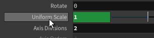
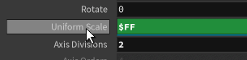

Click to switch value / parameter|`Ctrl` + `Shift` + `LMB` Remove variable
---|---
|

<br>

### Reset Value

`Ctrl` + `MMB` Reset Value
⚙️ > Revert to factory default
![[img/Houdini-Channel-Parameters/Reset Value.jpg]]

<br>

| Show value > Toggle Expression                           | Open Edit Expression: `Alt` / `Command` + `E`          |
| -------------------------------------------------------- | ------------------------------------------------------ |
| ![[img/Houdini-Channel-Parameters/toggleExpression.gif]] | ![[img/Houdini-Channel-Parameters/EditExpression.gif]] |
![[img/Houdini-Channel-Parameters/channel-expression.png]]

<mark style="background-color: #3A4F7F">Light blue</mark> - Complex Expression are directly controlled / keyframed by an expression
Dark blue - Simple Channel Reference are flexible because they lack a keyframe
Yellow - indicates you are trying to change a keyframed expression

<br>

### Copy Paste Parameters

Copy parameter|Paste Relative References|Paste Absolute References]
---|---|---
![[img/Houdini-Channel-Parameters/Copy parameter.png]]|![[img/Houdini-Channel-Parameters/Paste Relative References.png]]|![[img/Houdini-Channel-Parameters/Paste Absolute References.png]]

[ch expression function](https://www.sidefx.com/docs/houdini/expressions/ch.html)

Absolute path

Relative path

<br>

### Dependency

Dependency Links are connections created by expressions

Show Dependency Link > View > Dependency Links

`RMM` > More > View Dependencies

  

Dependency Link that links outside the network|Hide Parameter
---|---
![[img/Houdini-Channel-Parameters/Dependency Link that links outside the network.png \| 300]]|![[img/Houdini-Channel-Parameters/Hide Parameter.png]]
  

<br>

### Edit Interface
![[img/Houdini-Channel-Parameters/Edit Interface.png]]

`RMB` on the node > Parameters and Channels > Edit Parameter Interface

-   Native Parameters - parameters part of the Native Asset or HDA
    
-   Spare Parameters - Custom parameters added to specific mode  

Name -> Code Reference Name

Label -> Show name
![[img/Houdini-Channel-Parameters/Float and Int parameters with a larger size than 1 are numbered.png]]

Float and Int parameters with a larger size than 1 are numbered

Vector Parameters use x y z to indicate their components

Set default value: Parameter Description > Channel
![[img/Houdini-Channel-Parameters/Set default value.png]]

-   Default value font -> regular font ![[img/Houdini-Channel-Parameters/4.png | 30]]

-   Changed value font -> bold font ![[img/Houdini-Channel-Parameters/-3.78.png | 50]]

<br>

Expose Switch # as Dropdown Menu

![[img/Houdini-Channel-Parameters/switch-dropmenu.png]]

<br>

1.  Integer
    
    ![[img/Houdini-Channel-Parameters/integer.png]]
    
2.  Ordered Menu
	
	![[img/Houdini-Channel-Parameters/ordermenu.png]]


  

Remove Menu and Action that were brought by Group

![[img/Houdini-Channel-Parameters/Remove Menu and Action that were brought by Group.png]]

![[img/Houdini-Channel-Parameters/removeMenuActionButton.gif]]

Parameters Type

-   Toggle - a Boolean on/off button that returns 0 or 1
    
-   Clean up Tips:
    
    -   Folder
	![[img/Houdini-Channel-Parameters/folder.png]]
    
    -   File
    ![[img/Houdini-Channel-Parameters/file-cleanup.png]]

---

### Create Multi-Parameter interface

[[YouTube] Multiparm in Houdini, HDA and for-each basics tutorial by Houdini Element](https://www.youtube.com/watch?v=00gF31TMFsw)

|1. Create Folder|2.  Link Iteration to the folder|
---|---
First instance|First instance, no need to add 1
![[img/Houdini-Channel-Parameters/multi-param-block.png]]|![[img/Houdini-Channel-Parameters/iteration.png]]


3.  Parameter "#" -> iteration number
    

```C#
// 1
ch( strcat( '../scale2', detail('../repeat_begin1_metadata1/', 'iteration', 0) + 1 ) )

// 3 +
ch (strcat('../'),'r' ) // rgb
,''ch (strcat('../'),'x' ) // xyz 
```

![[img/Houdini-Channel-Parameters/Parameter.png | x500]]
